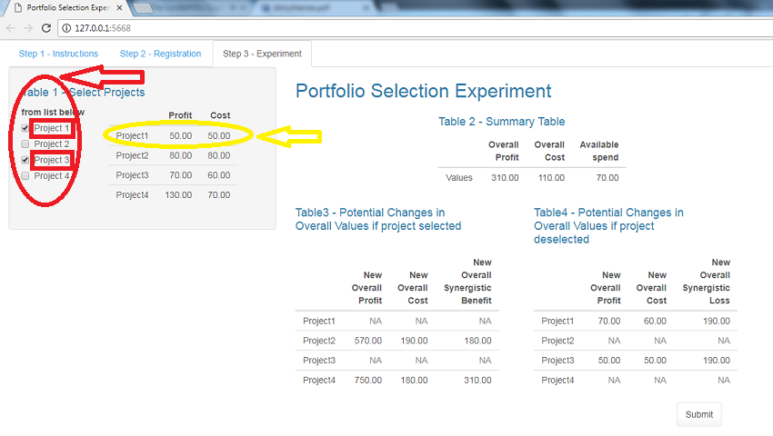
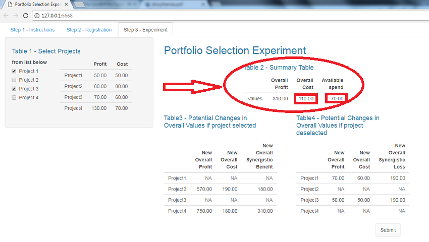
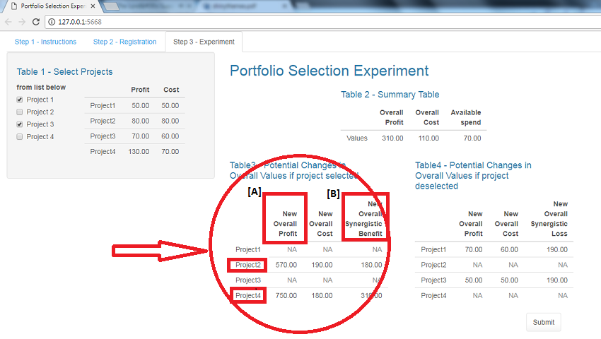
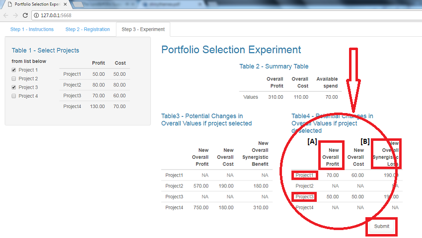

### In this experiment, you are tasked with selecting the best subset of projects out of a list of projects. The best subset is the one that yields maximum overall return (profit) within available budget.

### Table 1 below shows all projects with corresponding profit and cost. A project is selected by ticking its name. Similarly, a project is deselected by unticking its name. Project 1 costs 50 units and yields a profit of 50 units. 

### Table 2 below shows overall profit and cost of the currently selected set of projects, and the amount of money you still have available to spend. In this example, 110 units have already been spent (on both projects 1 and 3) and 70 units are still available.

### There are synergies between projects, i.e. there is increased profit associated with implementing some projects together but some projects interact better than others.

### Table 3 below shows the potential profit that will result from adding each of the projects not currently selected (Projects 2 and 4) to those already selected (Projects 1 and 3). New overall profit (denoted by [A] in Table 3) includes potential synergistic benefit (denoted by [B] in Table 3).

### Table 4 below shows the potential profit that will result from removing each of the projects from the set of currently selected projects. Similarly, new overall profit (denoted by [A] in Table 4) includes potential synergistic loss (denoted by [B] in Table 4).

### You don't have to spend all your budget as long as you are satisified with the subset of projects you have selected. You can select as many projects as you want as long as you are within budget.

### Once you press the "Submit" button, you will get confirmation that your selection of projects has been captured and you will be issued with a code. You should return to Mechanical Turk then and enter the code in the box provided.

## Please proceed to the next tab to register for the experiment.

